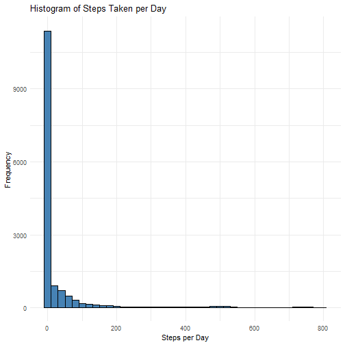
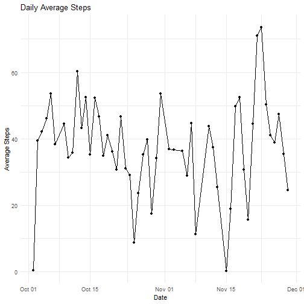
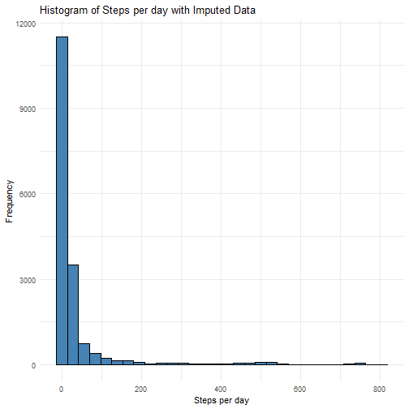
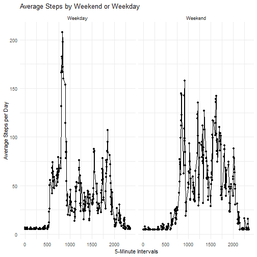

# PA1_template
Samuel Baird

## Loading in the Dataset

Let's first load in the data by creating a filepath object, loading the data.table package, and finally creating the data.table object (dt) using the fread function of the data.table package on the filepath object.

``` r
filepath <- "Reproducible/repdata_data_activity/activity.csv"

library(data.table)
```

```
## data.table 1.17.8 using 4 threads (see ?getDTthreads).  Latest news: r-datatable.com
```

``` r
dt <- fread(file = filepath)
```


## Creating a Histogram of Steps Per Day

First, we remove all NA values from the dt. Then, we load in the ggplot package to plot the histogram. lastly, we plot the histogram of steps per day using the ggplot package.

``` r
dt <- dt[!is.na(steps),] 

library(ggplot2) 

ggplot(data = dt, 
       mapping = aes(x = steps) 
       ) +
  geom_histogram(binwidth = 20, 
                   color = "black", 
                 fill = "steelblue" 
                 ) +
  labs(title = "Histogram of Steps Taken per Day", 
       x = "Steps per Day", 
       y = "Frequency" 
       ) +
  theme_minimal() 
```



## Mean and Median Steps per Day

To determine the mean and median step per day, we first create an object (mean_steps_day) that include the mean steps by each day in the data table (dt). We then print the object to ensure we have correctly identified the mean steps by each day. 

Next, we do the same thing but now to determine the median steps per day in the median_steps_day object.

``` r
mean_steps_day <- dt[, mean(steps), date] 
print(mean_steps_day)
```

```
##           date         V1
##         <IDat>      <num>
##  1: 2012-10-02  0.4375000
##  2: 2012-10-03 39.4166667
##  3: 2012-10-04 42.0694444
##  4: 2012-10-05 46.1597222
##  5: 2012-10-06 53.5416667
##  6: 2012-10-07 38.2465278
##  7: 2012-10-09 44.4826389
##  8: 2012-10-10 34.3750000
##  9: 2012-10-11 35.7777778
## 10: 2012-10-12 60.3541667
## 11: 2012-10-13 43.1458333
## 12: 2012-10-14 52.4236111
## 13: 2012-10-15 35.2048611
## 14: 2012-10-16 52.3750000
## 15: 2012-10-17 46.7083333
## 16: 2012-10-18 34.9166667
## 17: 2012-10-19 41.0729167
## 18: 2012-10-20 36.0937500
## 19: 2012-10-21 30.6284722
## 20: 2012-10-22 46.7361111
## 21: 2012-10-23 30.9652778
## 22: 2012-10-24 29.0104167
## 23: 2012-10-25  8.6527778
## 24: 2012-10-26 23.5347222
## 25: 2012-10-27 35.1354167
## 26: 2012-10-28 39.7847222
## 27: 2012-10-29 17.4236111
## 28: 2012-10-30 34.0937500
## 29: 2012-10-31 53.5208333
## 30: 2012-11-02 36.8055556
## 31: 2012-11-03 36.7048611
## 32: 2012-11-05 36.2465278
## 33: 2012-11-06 28.9375000
## 34: 2012-11-07 44.7326389
## 35: 2012-11-08 11.1770833
## 36: 2012-11-11 43.7777778
## 37: 2012-11-12 37.3784722
## 38: 2012-11-13 25.4722222
## 39: 2012-11-15  0.1423611
## 40: 2012-11-16 18.8923611
## 41: 2012-11-17 49.7881944
## 42: 2012-11-18 52.4652778
## 43: 2012-11-19 30.6979167
## 44: 2012-11-20 15.5277778
## 45: 2012-11-21 44.3993056
## 46: 2012-11-22 70.9270833
## 47: 2012-11-23 73.5902778
## 48: 2012-11-24 50.2708333
## 49: 2012-11-25 41.0902778
## 50: 2012-11-26 38.7569444
## 51: 2012-11-27 47.3819444
## 52: 2012-11-28 35.3576389
## 53: 2012-11-29 24.4687500
##           date         V1
```

``` r
median_steps_day <- dt[, median(steps), date]  
print(median_steps_day)
```

```
##           date    V1
##         <IDat> <num>
##  1: 2012-10-02     0
##  2: 2012-10-03     0
##  3: 2012-10-04     0
##  4: 2012-10-05     0
##  5: 2012-10-06     0
##  6: 2012-10-07     0
##  7: 2012-10-09     0
##  8: 2012-10-10     0
##  9: 2012-10-11     0
## 10: 2012-10-12     0
## 11: 2012-10-13     0
## 12: 2012-10-14     0
## 13: 2012-10-15     0
## 14: 2012-10-16     0
## 15: 2012-10-17     0
## 16: 2012-10-18     0
## 17: 2012-10-19     0
## 18: 2012-10-20     0
## 19: 2012-10-21     0
## 20: 2012-10-22     0
## 21: 2012-10-23     0
## 22: 2012-10-24     0
## 23: 2012-10-25     0
## 24: 2012-10-26     0
## 25: 2012-10-27     0
## 26: 2012-10-28     0
## 27: 2012-10-29     0
## 28: 2012-10-30     0
## 29: 2012-10-31     0
## 30: 2012-11-02     0
## 31: 2012-11-03     0
## 32: 2012-11-05     0
## 33: 2012-11-06     0
## 34: 2012-11-07     0
## 35: 2012-11-08     0
## 36: 2012-11-11     0
## 37: 2012-11-12     0
## 38: 2012-11-13     0
## 39: 2012-11-15     0
## 40: 2012-11-16     0
## 41: 2012-11-17     0
## 42: 2012-11-18     0
## 43: 2012-11-19     0
## 44: 2012-11-20     0
## 45: 2012-11-21     0
## 46: 2012-11-22     0
## 47: 2012-11-23     0
## 48: 2012-11-24     0
## 49: 2012-11-25     0
## 50: 2012-11-26     0
## 51: 2012-11-27     0
## 52: 2012-11-28     0
## 53: 2012-11-29     0
##           date    V1
```

## Time Series Plot:Average Steps Taken Per Day

For interpretibility, we'll change the V1 column in the object mean_steps_day to "Steps". Now we will plot the object mean_steps_day with the x-axis as the date and the y-axis as the steps taken by date. This will use geom_line and geom_point so that we can see each day and the fluctutation in the mean steps taken throughout the length of the timeperiod provided in the data. 


``` r
setnames(x = mean_steps_day, old = "V1", new = "Steps")

ggplot(data = mean_steps_day, 
       mapping = aes(x = date, 
                     y = Steps) 
       ) +
  geom_line() + 
  geom_point() +  
  labs(title = "Daily Average Steps", 
                      x = "Date",
                      y = "Average Steps"
                      ) +
  theme_minimal() 
```



## 5-min int mean max steps

To determine the max mean steps taken by every 5-minute interval, we will first create an object (mean_steps) that includes the mean steps by every interval. Then, we will determine which row in this object contains the maximum mean steps using the which.max function and creating an object that contains the information for the interval and value of the max mean interval. 

``` r
mean_steps <- dt[, mean(steps), interval] 
print(mean_steps)
```

```
##      interval        V1
##         <int>     <num>
##   1:        0 1.7169811
##   2:        5 0.3396226
##   3:       10 0.1320755
##   4:       15 0.1509434
##   5:       20 0.0754717
##  ---                   
## 284:     2335 4.6981132
## 285:     2340 3.3018868
## 286:     2345 0.6415094
## 287:     2350 0.2264151
## 288:     2355 1.0754717
```

``` r
max_mean_steps <- mean_steps[which.max(V1)]
print(max_mean_steps)
```

```
##    interval       V1
##       <int>    <num>
## 1:      835 206.1698
```

## Histogram of Steps with Imputation

To impute the data, we will first create a new data.table object (dt2) that includes all NA values. We then inspect dt2 to determine which columns have NA values. From this, we determine that only the Steps variable contains NA values. We will also determine the class of steps to decide on which imputation method to use. As the class of the variables steps is numeric (Euclidean distace), we will impute using the mean. We will also inspect the total number of NA values to be imputed. Now, we will impute every missing value in the column steps, with the mean of steps determined without NA values. Finally, we will plot the entire dataset with the included missing values imputed by the step mean. 


``` r
dt2 <- fread(input = filepath)

is.na(dt2) 
dt2[, class(steps)] 

dt2$steps[is.na(dt2$steps)] <- mean(dt2$steps, na.rm = TRUE)

steps_per_day <- dt2[, steps, date]
ggplot(data = steps_per_day, mapping = aes(x = steps)) +
  geom_histogram(colour = "black", 
                 fill = "steelblue") +
  labs(title = "Histogram of Steps per day with Imputed Data",
       x = "Steps per day",
       y = "Frequency") +
  theme_minimal()
```

```
## `stat_bin()` using `bins = 30`. Pick better value `binwidth`.
```



## Average Steps by Weekend/Weekday


To plot the average steps by weekend or weekday, we first create a new variable "Weekdays" using the weekdays function and apply it to the variable date in our data table. Next, we create a "Weekend" variable that is everything in the "Weekday" variable that only includes "Saturday" or "Sunday". We can now plot both the average steps for the Weekdays and Weekend days by using the facet_wrap function in ggplot. 

``` r
dt2[, Weekdays := weekdays(date)]

dt2[, Weekends := ifelse(Weekdays %in% c("Saturday", "Sunday"), 
                         yes = "Weekend", 
                         no = "Weekday")]

ggplot(data = dt2, mapping = aes(x = interval, 
                                 y = steps)) +
         stat_summary(fun = mean, 
                      geom = "point") +
         stat_summary(fun = mean, 
                      geom = "line") + 
         theme_minimal() +
  facet_wrap(~Weekends) + 
  labs(title = "Average Steps by Weekend or Weekday", 
       x = "5-Minute Intervals",
       y = "Average Steps per Day")
```


